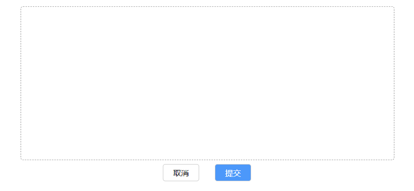

# signature-pad-rotate
基于 [signature_pad](https://github.com/szimek/signature_pad) 适用于 React 的支持移动端旋转的签名组件，适配横竖屏，始终保持签名面板为横屏，并且生成的签名始终为横向。



## Installation

```bash
npm i signature-pad-rotate
```

## Usage

详细的例子：[Demo](./example/index.tsx)

### 基本用法
```tsx
import SigPadRotate from 'signature-pad-rotate';

const Demo: React.FC = () => {
  
  const [sigPadVisible, setSigPadVisible] = useState<boolean>(false);

  // ...

  return (
    // ...
    {
      sigPadVisible ? (
        <SigPadRotate
          options={{
            minWidth: 5, maxWidth: 10, penColor: 'rgb(66, 133, 244)',
          }}
          onSubmit={(file: File) => {
            // TODO sth...
          }}
          onCancel={() => {}}
        />
      ) : null
    }

  );
}
```

### ref 运行时

```tsx
import SigPadRotate from 'signature-pad-rotate';
// * 可自定义画板及按钮样式，具体参考本项目 example/index.css
// import './demo.css';

const Demo: React.FC = () => {

  const sigPadRef = React.createRef<SigPadRotate>();

  // ...

  return (
    <SigPadRotate
      ref={sigPadRef}
      footer={
        <div>
          <button onClick={() => {
            const sigpad = sigPadRef.current;
            sigpad?.clear();
          }}>清除</button>
          <button onClick={() => {
            const sigpad = sigPadRef.current;
            sigpad?.toDataUrl().then(imgDataUrl => {
              setImgUrl(imgDataUrl);
              sigpad?.close();
            });
          }}>提交</button>
        </div>
      }
      canvasProps={{
        style: {
          // border: '2px solid #000',
          backgroundColor: 'orange',
        },
      }}
    />
  )
}
```

## Example
关于深度定义样式，参考本项目提供的简单示例，引入相应的 `css` 文件即可：
```bash
cd example && npm i

# run example
npm start
```


## API

| 参数 | 说明 | 类型 |
|---|---|---|
| footer? | 自定义按钮组及事件 | React.ReactNode |
| options? | signature_pad Options | [Options](https://github.com/szimek/signature_pad/blob/master/README.md#options) |
| canvasProps? | canvas 画板 dom 的 props |  |
| onSubmit? | 默认的提交事件，返回数据类型为 File | (file: File) => {} |
| onCancel? | 默认的取消事件，关闭组件 | () => void |
| onEmpty? | 默认的提交时，签名板为空 | () => void |

ref
```ts
const sigPadRef = React.createRef<SigPadRotate>();

// ...
const sigpad = sigPadRef.current;


// 转换为 dataUrl
// 参数参考 signature_pad
sigpad?.toDataUrl(type?: string, encoderOptions?: number).then((imgDataUrl: string) => {
  // TODO
});

// 转换为 image File
// 参数参考 signature_pad
sigpad?.toImgFile(type?: string, encoderOptions?: number).then((file: File) => {
  // TODO
});

// 检查签名是否为空
sigpad?.isEmpty();

// 关闭组件
sigpad?.close();
// 清空画板
sigpad?.clear();
```
